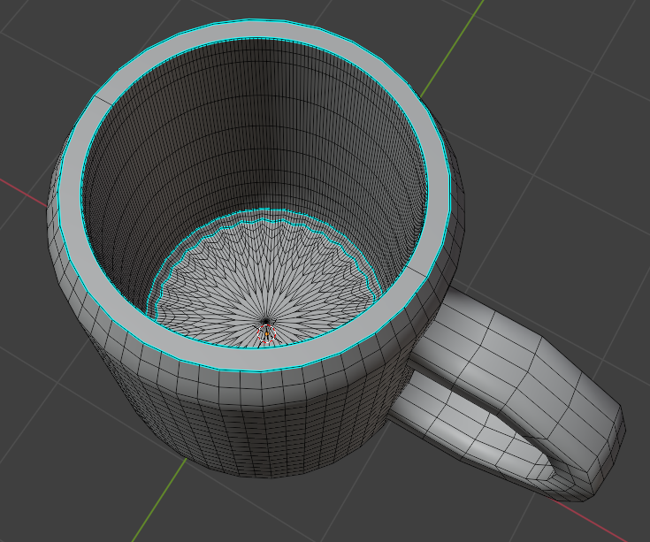
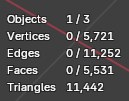
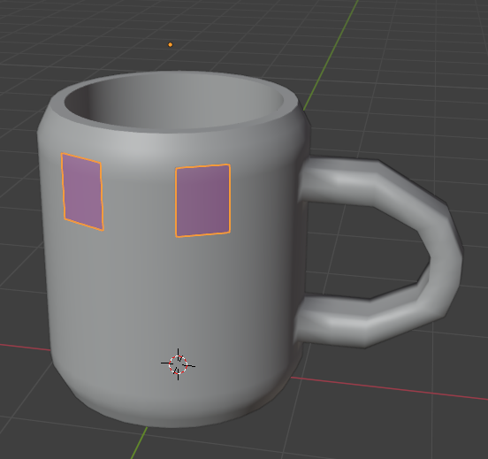
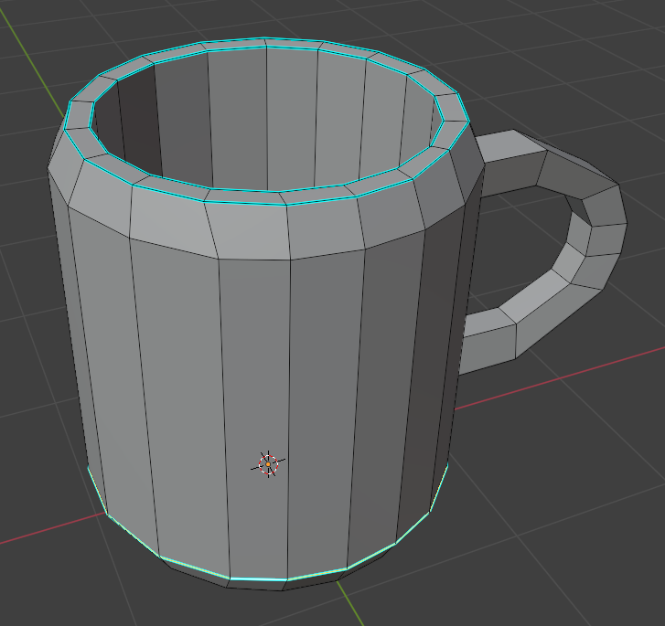
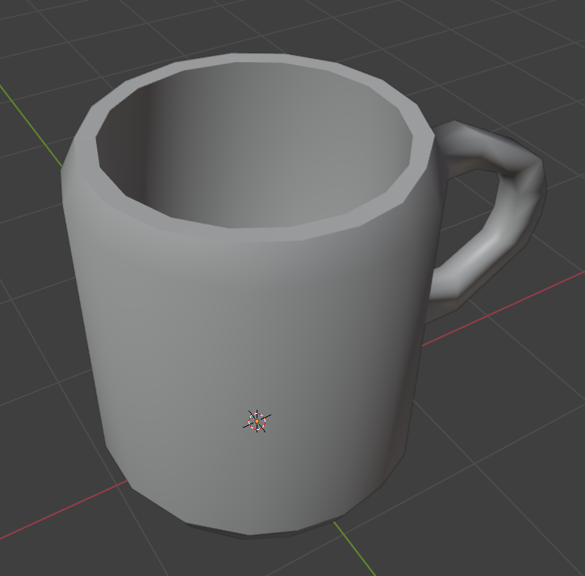
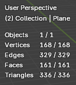
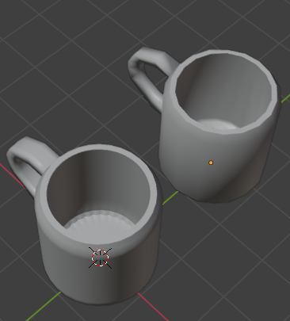

Autor: Gabriel Álvarez de Pablo (Wismy)

# Documentación del Proceso Creativo: Retopología

## Original

## Proceso

He optado por realizarlo a mano, puesto que el modificador que se muestra en el vídeo (*Shrinkwrap*) ajusta los vértices al objeto original, siendo esto lo que parece hacer Retopoflow por detrás.

**Set-up:** [How to Retopologize in Blender without Addons](https://www.youtube.com/shorts/HmIeYfdmm34?feature=share)

Una vez hecho lo del video nos queda así:

Tras esto, se procede a realizar todo el contorno de la taza.
Al finalizar se marcan algunas aristas que no queremos que se smootheen:

## Resultado

Le aplicamos el Shade Smooth y el restulado queda así:

## Comparación

