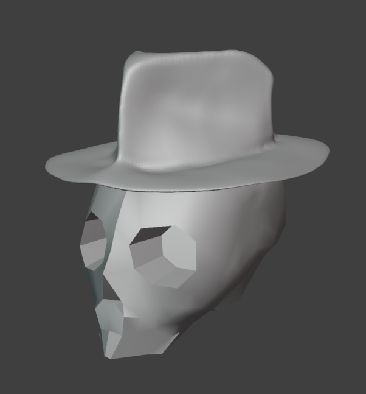
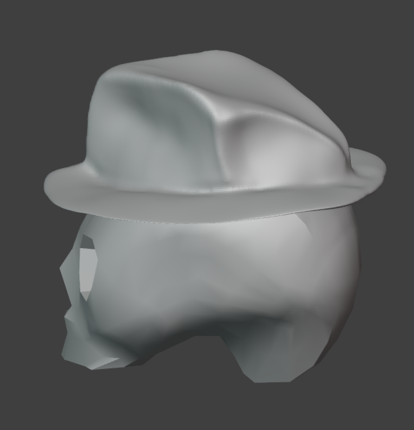

Autor: Gabriel Álvarez de Pablo (Wismy)

# Documentación del Proceso Creativo: Calavera con Sombrero

## Explicación

La calavera nació de un cubo, el cual fue subdividido y modificado, para crear la forma de la calavera. A partir de ahí, se le fue dando forma a los detalles de la calavera, como los ojos, la nariz o la mandíbula.

El sombrero fue creado a partir de un plano, se extruyó una cara interior para hacer la parte mas alta, y a partir de ahí se pasó al modo de escultura. En ese modo, se usaron muchos pinceles pero sobre todo los de *Smooth, Trim, Grab, Pinch y Draw*. Durante el proceso, se hizo simultaneamnete las dos mitades del sobrero, para posteriormente, elegir la que mejor quedaba, y aplicarle el mirror. Después se hizo un pequeño retoque para elminar la perfecta simetría.

## Resultado

