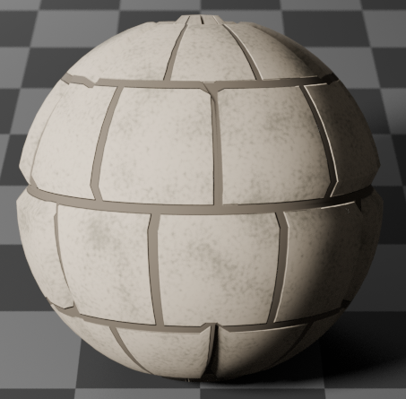
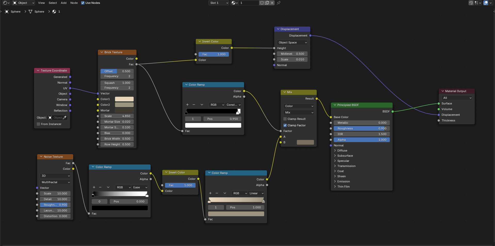

Autor: Gabriel Álvarez de Pablo

### Tutorial: Cómo crear la textura mostrada en la imagen usando Blender

Este tutorial te guiará paso a paso para recrear la textura que se muestra en el editor de nodos de Blender. La textura combina patrones de ladrillos y ruido con desplazamiento geométrico para lograr un efecto visual interesante.

---

### **Pasos para configurar los nodos:**

#### **1. Añadir el nodo "Texture Coordinate"**
- En el editor de nodos, presiona `Shift + A` y selecciona **Input > Texture Coordinate**.
- Este nodo genera las coordenadas necesarias para mapear las texturas.

#### **2. Crear la textura de ladrillos**
- Añade un nodo **Brick Texture** (`Shift + A > Texture > Brick Texture`).
- Conecta la salida **Generated** del nodo "Texture Coordinate" a la entrada **Vector** del nodo "Brick Texture".
- Ajusta los parámetros del nodo:
  - **Offset**: 0.500
  - **Frequency**: 1.000
  - Configura los colores del ladrillo y del mortero según prefieras.

#### **3. Invertir los colores**
- Añade un nodo **Invert Color** (`Shift + A > Color > Invert`).
- Conecta la salida **Color** del nodo "Brick Texture" al nodo "Invert Color".

#### **4. Configurar el desplazamiento geométrico**
- Añade un nodo **Displacement** (`Shift + A > Vector > Displacement`).
- Conecta la salida del nodo "Invert Color" al puerto **Height** del nodo "Displacement".
- Ajusta los valores:
  - **Midlevel**: 0.500
  - **Scale**: 0.010.

#### **5. Crear ruido procedural**
- Añade un nodo **Noise Texture** (`Shift + A > Texture > Noise Texture`).
- Ajusta los parámetros:
  - **Scale**: 10.000
  - **Detail**: 2.000
  - **Roughness**: 0.500.

#### **6. Modificar el ruido con gradientes**
- Añade un nodo **Color Ramp** (`Shift + A > Converter > Color Ramp`) y conecta la salida **Fac** del nodo "Noise Texture" al puerto correspondiente.
- Ajusta el gradiente en el "Color Ramp" para definir las variaciones del ruido.

#### **7. Invertir el gradiente**
- Añade otro nodo **Invert Color** y conecta la salida del primer "Color Ramp" al puerto de entrada de este nuevo nodo.

#### **8. Refinar el gradiente**
- Añade otro nodo "Color Ramp" y conecta la salida del segundo nodo "Invert Color".
- Ajusta nuevamente el gradiente según tus necesidades.

#### **9. Combinar las texturas**
- Añade un nodo **Mix RGB** (`Shift + A > Color > Mix`).
- Conecta:
  - La salida del último "Color Ramp" al puerto A.
  - La salida del primer "Color Ramp" (que proviene de la textura de ladrillos) al puerto B.
- Ajusta el tipo de mezcla (por defecto es Mix).

#### **10. Aplicar el shader principal**
- Añade un nodo **Principled BSDF** (`Shift + A > Shader > Principled BSDF`).
- Conecta la salida del nodo "Mix RGB" al puerto de entrada de color base (**Base Color**) en el Principled BSDF.

#### **11. Salida final**
- Añade un nodo **Material Output** (`Shift + A > Output > Material Output`).
- Conecta:
  - La salida del Principled BSDF al puerto BSDF del Material Output.
  - La salida del nodo "Displacement" al puerto de desplazamiento (**Displacement**) en el Material Output.

---

### Configuración final:
Tu gráfico de nodos debería verse igual que en la imagen proporcionada, con todos los nodos conectados correctamente y los parámetros ajustados según las instrucciones anteriores.

Ahora puedes aplicar este material a cualquier objeto en tu escena y observar cómo se renderiza con las características configuradas. ¡Experimenta con los valores para personalizar aún más tu textura!
