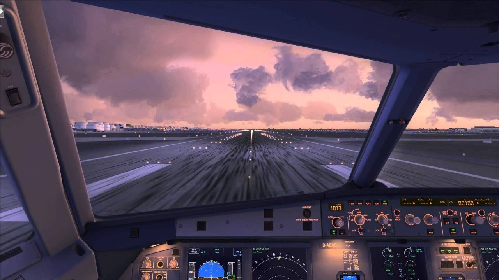
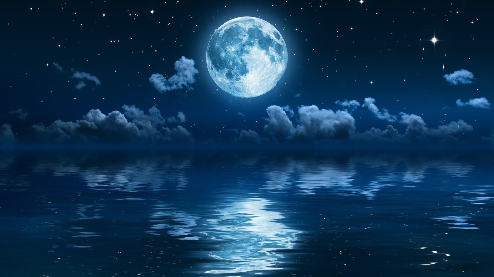
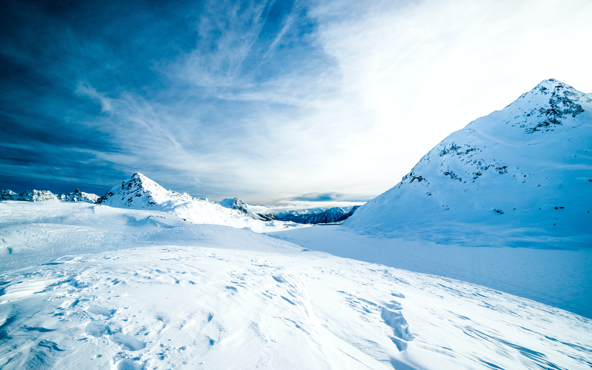

# MATTE PAINTING

Gabriel Álvarez de Pablo (Wismy)

## Imágenes base
Estas son las imágenes sin ninguna modificación que se han usado:

## Imágen sin filtros
Tras recortar las imágenes, se han aplicado filtros para hacer que todo se integre, este es el resultado de la imagen sin filtros:

## Imágenes modificadas
Se han modificado las imágenes para su integración con el resto de la imagen. Esto implica aplicar máscaras de capa de transparencia, niveles, balance de color, HSV... :
- En el caso del elogio, se han tenido que mover las sombras para que cuadrasen con el resto de la imagen:

- A la cabina a demás, se le ha aplicado un efecto espejo para que no tape la montaña:

- En la montaña grande se ha tenido que colorizar puesto que destacaba mucho

- Se ha dejado la niebla para hacer un efecto de FOG. El lobo se ha dejao pues no se ve:

- Se ha colorizado e iluminado la luna para que emita la luz que se ve en la foto:

- Se ha cambiado el cielo para aplicar más imagenes y usar las nubes tras la montaña:

## Resultado

