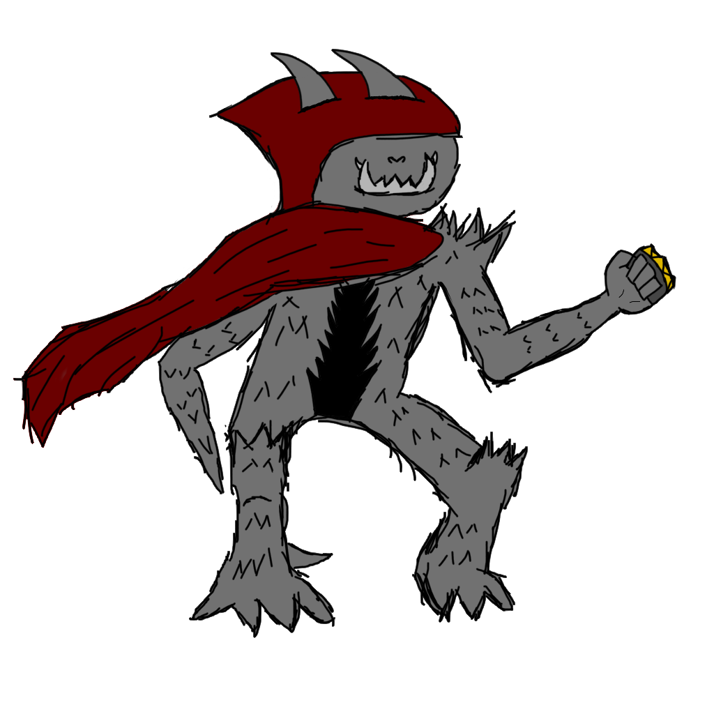

Autor: Gabriel Álvarez de Pablo (Wismy)

# Documentación del Proceso Creativo: HIPOTROCLEOS

## Explicación

Partiendo de la base de Marcos, **Hipotrocle**:

Nació, **Hipotrocleos**:

La idea principal era no cambiar mucho su apariencia siniestra, que siguiera manteniendo ese aura misterioso bajo la capucha de la capa, así que decidí añadirle detalle a la parte central del pecho, unos cuernos, mas pinchos, pinchos el puño americano y otro brazo, pero un poco distinto... De esta manera, podrá hacer daño contundente y cortante ya que su nuevo brazo es un pico gigante.

Y lo mejor de todo, a sus colmillos... le salen otros colmillos! :D

## Resultado

[Evolution draw](images/evolution.png)

[Evolution sprite](images/EvolutionSprite.png)

[Evolution animatio](images/EvolutionSpriteGif.gif)

