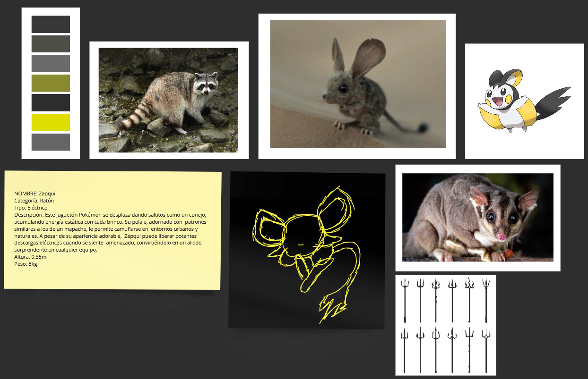
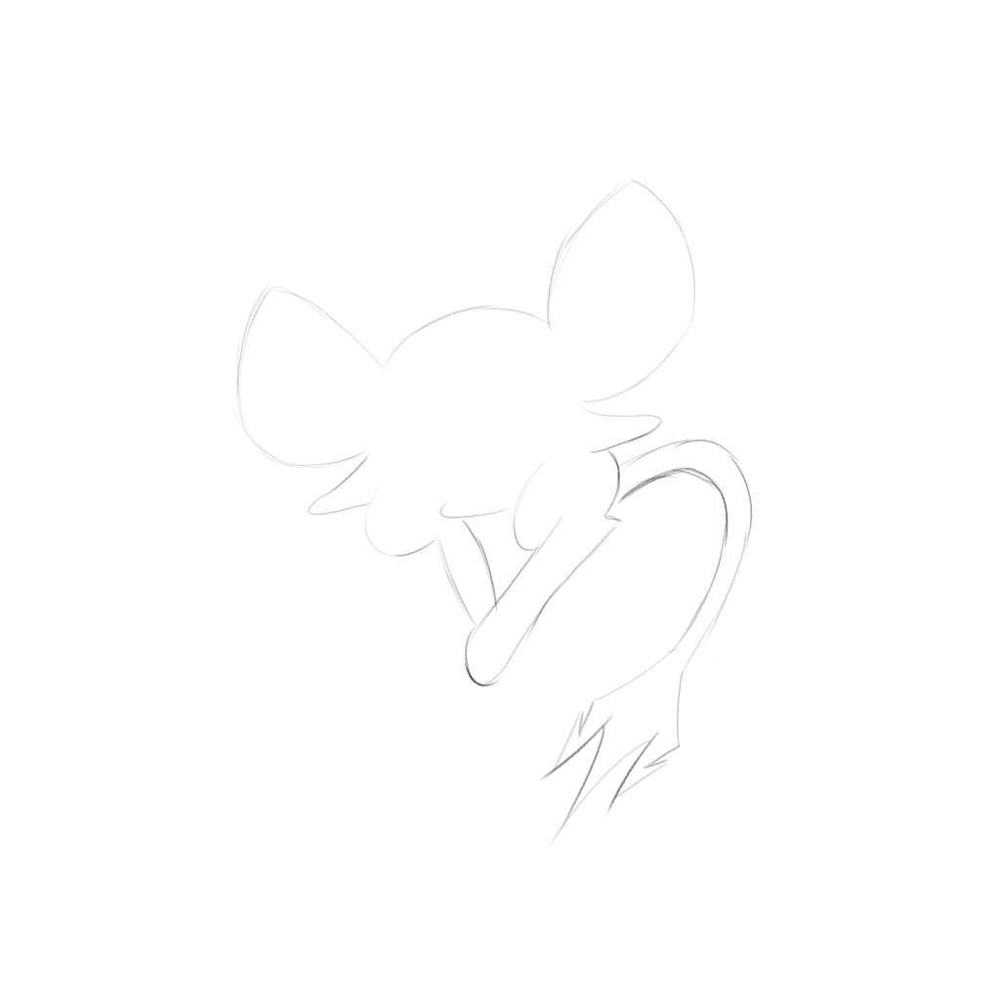
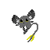
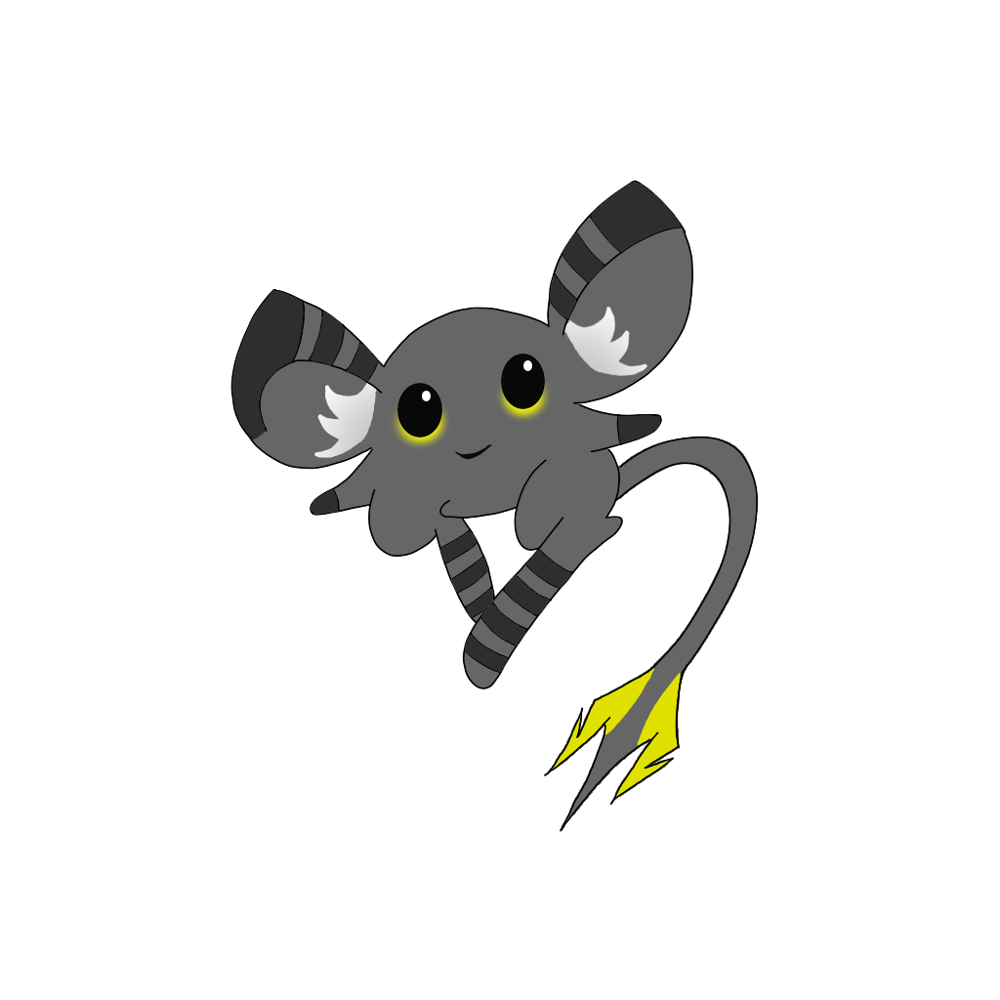
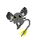

Autor: Gabriel Álvarez de Pablo (Wismy)

# Documentación del Proceso Creativo: Zapqui

### Concepto Inicial e Inspiraciones

El diseño de Zapqui nació de la fusión entre:
- Ratón del desierto de la película Dune
- Elementos eléctricos urbanos
- Necesidad de adaptación de la naturaleza a entornos urbanos

Influencias principales:
- Ratón del desierto (Dune)
- Patrones de mapache (camuflaje urbano)
- Conejos (forma de saltar)
- Fenómenos de electricidad estática

### Técnicas Creativas Utilizadas

1. Brainstorming
2. Moodboard
3. Bocetado rápido
4. Selección de paleta de colores
5. Diseño de sprite en pixel art

### Etapas del Diseño

1. **Bocetos iniciales**
   - Boceto inicial con la forma del pokemon en Krita
   - Experimentación con formas de orejas y cola (sobretodo cola)

2. **Refinamiento del concepto**
   - Selección y desarrollo del boceto más prometedor
   - Adición de patrones de mapache
   - Ajuste de la forma del cuerpo

3. **Diseño de color**
   - Pruebas de combinaciones de colores
   - Selección de tonos grises con acentos amarillos eléctricos
   - Adición de brillos en mejillas

4. **Creación del sprite**
   - Diseño de sprite 64x64 píxeles
   - Animación

5. **Ajustes finales**
   - Adición de detalles: brillo en ojos, particulas de electricidad, etc.

6. **Creación de la animación**
   - Creación del sprite final de la animación y creación de los frames entre el final y el original.

