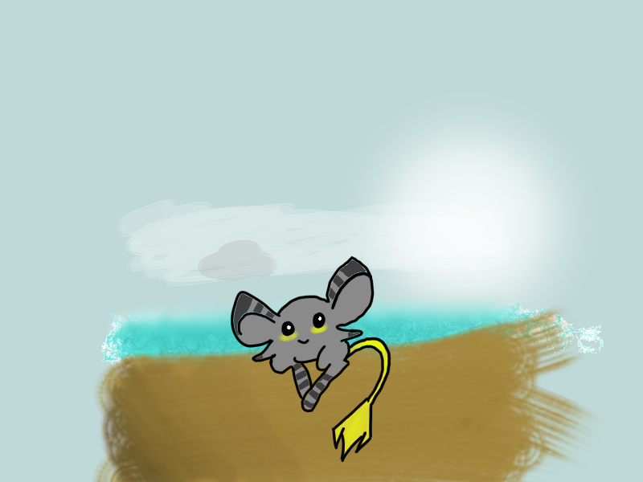
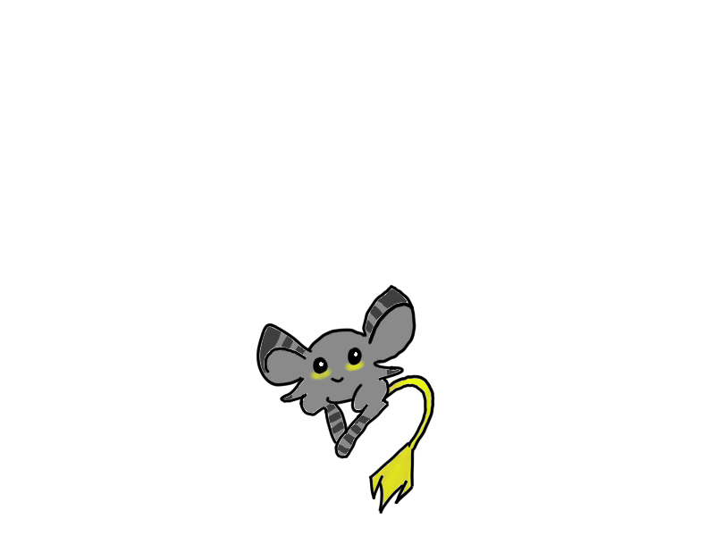
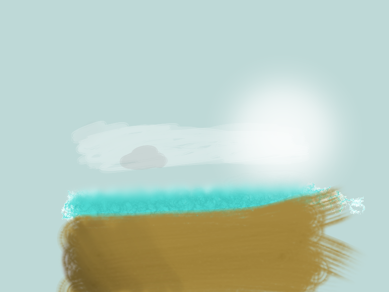

# SPEED PAINTING

Gabriel Álvarez de Pablo (Wismy)

## Proceso
No había ningún boceto o idea del pokemon antes de hacer el speedpainting, así que la mayoría del tiempo se consumió en crearlo de cero.

En el fondo, se usaron distintos pinceles de textura pero es demasiado simple por esta falta de tiempo.

A todo esto, se le suma que mientras se creaba, la imagen estaba con zoom. Así que realmente el speedpainting es menor que el tamaño original del lienzo.

## Resultado
Este es el resultado final:

## Pokemon
Esta es la imagen del pokemon únicamente:

## Background
Esta es la imagen del fondo únicamente:

## Conclusión
El resultado tiene muchos fallos.

**6/10**
