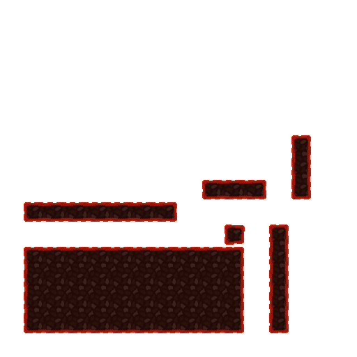

# TILESET / TILEMAP

Autor: Gabriel Álvarez de Pablo (Wismy)

## Explicación
Eh decidido realizar el tileset inspirado en el nether del Minecraft, para hacerlo cálido, a diferencia del Elogio, para probar el otro estilo también (y para llevar la contraria). Eh usado la siguiente imagen de refencia:

## Resultado
Mi tileset:

Ejemplo del tilemap:

